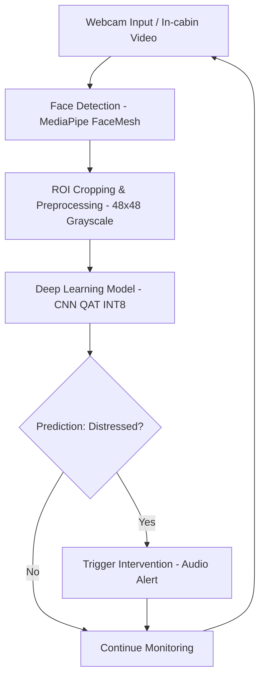

# **DriveSense: AI-Enhanced Driver Wellness Monitoring System** 🚗🧠

[](https://www.python.org/) 
[](https://www.tensorflow.org/) 
[](https://opencv.org/)

---

## **🚨 Project Overview**

**DriveSense** is a real-time AI-powered driver wellness monitoring system that detects fatigue, stress, or emotional distress. Using **deep learning and computer vision**, it analyzes facial expressions, eye movements, and subtle behavioral cues.  
When distress is detected, it provides **non-intrusive interventions** like **gentle audio cues** to keep drivers alert and safe.

---

## **🎯 Problem Statement**

- Driver fatigue and stress reduce alertness, increasing accident risk.  
- Existing systems mostly focus on vehicle safety, ignoring driver wellness.  
- A **real-time, AI-powered solution** is required to monitor wellness and provide interventions.

---

## **💡 Motivation**

- Enhance **road safety** by detecting distress early.  
- Provide **personalized alerts** to maintain focus.  
- Efficiently deployable on **edge devices** like laptops or Jetson Nano.

---

## **📦 Dataset**

- **FER2013** – Facial Emotion Recognition dataset: [Download here](https://www.kaggle.com/datasets/msambare/fer2013)  
- **NTHU-DDD** – Drowsiness detection (eye closure, yawning): [Download here](https://www.kaggle.com/datasets/samymesbah/nthu-dataset-ddd-multi-class)
- Custom webcam-augmented images  

_Preprocessing_: 48×48 grayscale for optimized inference.

> **Dataset Prep:** See [`prepare_dataset.py`](./prep_dataset.py) for dataset preprocessing steps.

---

## **🧠 Model & Training**

- **CNN** for binary classification: `Happy/Calm` vs `Distressed/Anxious`  
- **Quantization-Aware Training (QAT)** with **TensorFlow Lite INT8**  
- Face detection via **MediaPipe FaceMesh**, ROI cropping, grayscale conversion, normalization  
- Trained using **Adam optimizer** and **binary cross-entropy** loss  
- **Validation split**: 80/20 train-test  


> **Training Script:** Refer to [`train_quantized_model.py`](./train_quantized_model.py) for full model training and TFLite conversion.

---

## **⚡ Features**

- Real-time **driver wellness detection**  
- Emotion & distress classification with **frame smoothing**  
- Non-intrusive interventions: gentle **audio alerts**  
- Interactive UI: face mesh overlay, confidence, threshold adjustments  
- **Edge deployment optimized** with **TFLite INT8** model  

---

## **🛠 Tech Stack**

| Category | Tools & Frameworks |
|----------|------------------|
| Programming | Python 3.10+ |
| Deep Learning | TensorFlow, Keras, TensorFlow Lite |
| Computer Vision | OpenCV, MediaPipe |
| Audio Feedback | Pygame Mixer |
| Model Optimization | INT8 Quantization, TFLite Interpreter |
| Deployment | Local / Edge Device (Laptop, Jetson Nano, Raspberry Pi) |

---

## **📈 Workflow / Flowchart**


---

## **🚀 How to Run**

Clone repository

```
git clone https://github.com/AaryanGole26/DriveSense.git
cd DriveSense
```

Install dependencies

```
pip install -r requirements.txt
```

Prepare music folder

Add ≥5 MP3 tracks in songs/ directory

Run the program

```
python driver_wellness_monitor.py
```
---

## **Controls:**

Q → Quit

P → Pause/Resume music

T → Toggle threshold (0.5 ↔ 0.7)

V → Toggle verbose mode

F → Toggle fullscreen

M → Toggle face mesh overlay

---

## **📊 Performance**

Real-time inference ~30 FPS

Validation Accuracy: ~81–82%

Optimized INT8 TFLite model suitable for edge deployment

---

## **📝 Future Enhancements**

Multimodal detection (steering + wearables)

Personalized driver models for better accuracy

Cloud integration for fleet analytics

Integration with infotainment systems

---

## **📌 References**

FER2013 Dataset

NTHU Dataset

TensorFlow Lite Quantization Guide

MediaPipe FaceMesh Documentation
